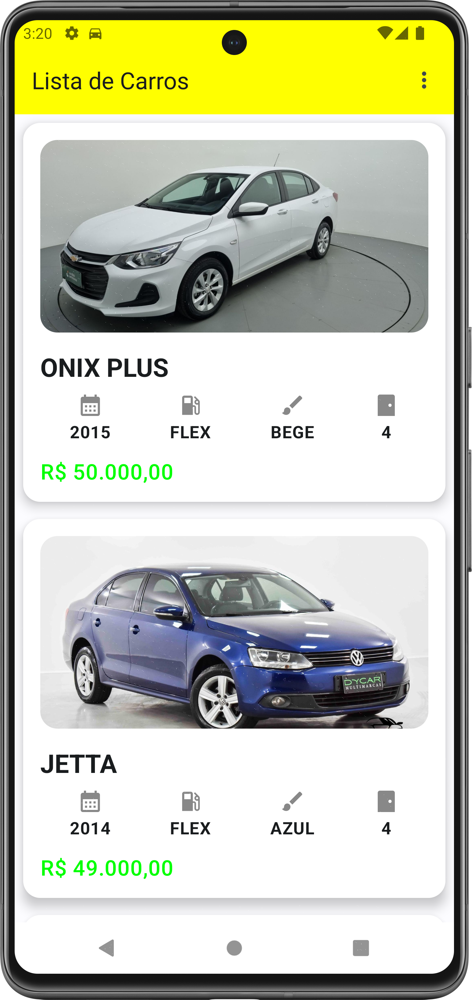
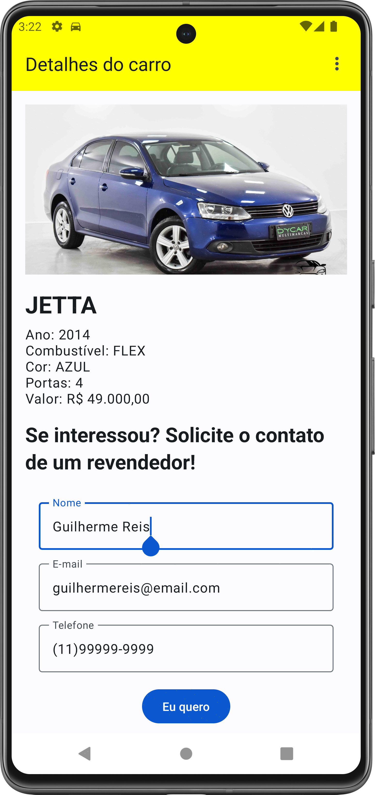
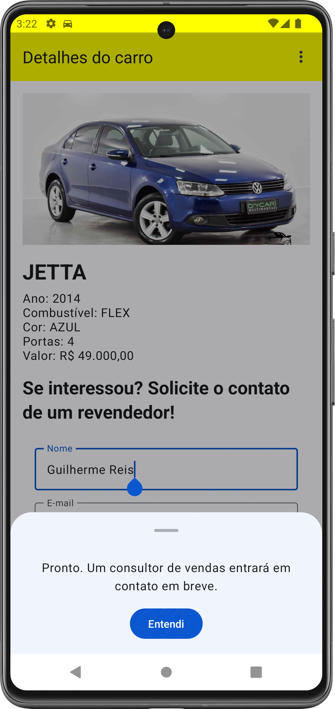
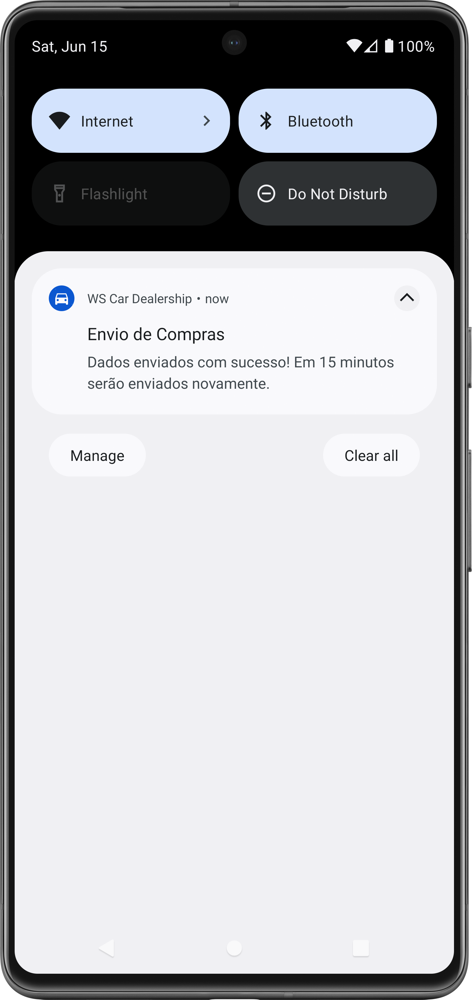

# WS Car Dealership

Um app de concessionária de carros.

Autor: Guilherme Reis - [LinkedIn](https://www.linkedin.com/in/guilhermereisdev/)

### Recursos do app

- Exibe carros disponíveis para venda.
- Permite o usuário declarar interesse pelos carros, inserir telefone/e-mail e solicitar o contato de um consultor.

### Técnicas utilizadas

- Interface utilizando Jetpack Compose.
- Arquitetura MVVM com Clean Architecture.
- Banco de Dados local utilizando Room.
- Rotina de upload do banco de dados local utilizando WorkManager.
- Injeção de dependências utilizando Hilt.
- Conexão à API para acesso aos dados dos carros à venda utilizando Retrofit.
- Coroutines para execução assíncrona.

### Decisões técnicas
- Telas criadas usando Jetpack Compose, que foi escolhido por ser uma biblioteca moderna e que facilita o desenvolvimento, a escalabilidade e manutenção do aplicativo. Também por possuir integração perfeita com outras bibliotecas do Jetpack e permitir a reutilização de componentes.
- Arquitetura MVVM com Clean Architecture, pela facilidade de manutenção e escalabilidade do código, por separar as responsabilidades e deixar o código mais organizado e também permitir adicionar novas funcionalidades sem comprometer as existentes.
- Banco de Dados utilizando Room por ser a principal alternativa e também mais simples para lidar com armazenamento local, comparado ao usar o SQLite diretamente.
- WorkManager por ser recomendado pelo Google e por garantir que a operação será executada mesmo em segundo plano ou com o aplicativo encerrado. O tempo de 15 minutos para novas requisições de upload dos dados das vendas foi definido assim por ser o menor prazo disponível pelo WorkManager.
- Hilt por ser uma biblioteca oficial do Jetpack e também por ser mais simples de ser configurado.
- Comunicação com a API com Retrofit por ser uma opção que simplifica muito a configuração por ser muito intuitivo, converter rapidamente JSON para objetos Kotlin e se integrar com Coroutines.
- Coroutines por ser uma alternativa bem leve, eficiente e simples de usar, e também se integrar à outras bibliotecas Jetpack.
- Quanto à loja em si, imaginei que o melhor cenário, para dar sentido ao que foi proposto ser feito no app, seria esse onde a ação do usuário solicitaria um contato com um consultor de vendas, já que praticamente não ocorrem vendas de carros diretamente por aplicativos.

### Telas

_Clique na imagem para ver em tela cheia_

    
